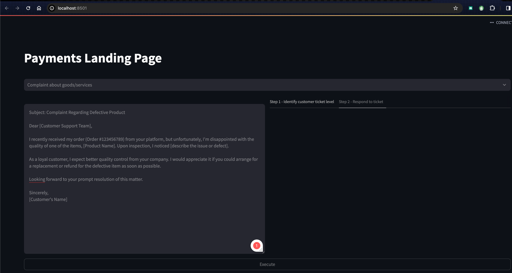

# About this repository
Overview of Payments related use cases - especially wrt to Customer Support

# Running this repository
* Install Python (>3.9) if you do not have it already

* Install the requirements
``$> pip install -r requirements.txt``

* Export the environment variable with an OPENAI API KEY 
``$> export OPENAI_API_KEY=<OPENAI_API_KEY>>``

* Run the program 
``$> streamlit run main.py``

You should have a browser launch with the app like the image below
